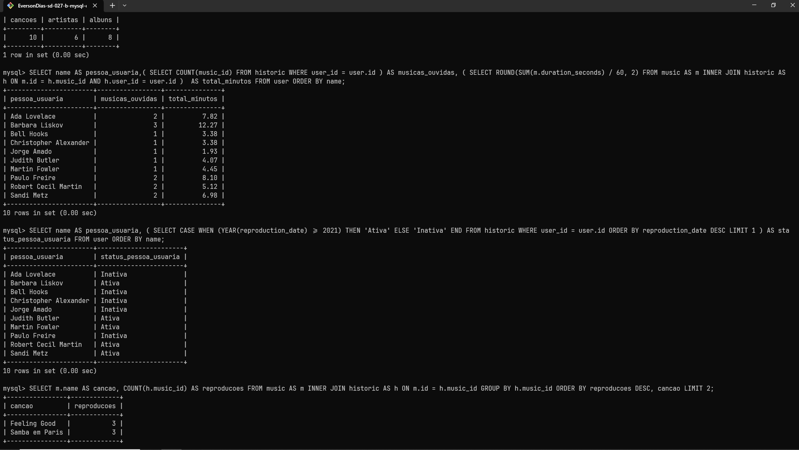

# MySQL One for All



# Índice

* [Título e Imagens Home](#mysql-one-for-all)
* [tecnologias utilizadas](#tecnologias-utilizadas)
* [Descrição do projeto](#descrição-do-projeto)
* [Status do Projeto](#status-do-projeto)
* [Funcionalidade do projeto](#🔨-funcionalidade-do-projeto)
* [Acesso ao Projeto](#acesso-ao-projeto)

# Tecnologias utilizadas


# Descrição do Projeto

O projeto "MySQL One for All" é parte do currículo da formação de Desenvolvedor Web da [Trybe](https://www.betrybe.com/). Nesse projeto, os alunos têm a oportunidade de aplicar seus conhecimentos em comando MySQL. 

# Status do Projeto

> 💹 Alpha 💹

# 🔨 Funcionalidade do projeto

- Exibe as estatísticas musicais
- Exibe o histórico de reprodução para cada pessoa usuária
- Exibe a condição da pessoa usuária se está ativa ou inativa
- Exibe top 2 hits mais tocados no momento
- Exibe o relatório de faturamento da empresa
- Exibe uma relação de todos os álbuns produzidos
- Exibe uma relação de álbuns produzidos pela artista Elis Regina

# Acesso ao projeto

Para acessar e executar este projeto, siga os passos abaixo:

1. Clone o Projeto

```bash
git clone https://github.com/EversonDias/MySQL_One_For_All.git OneForAll
```

2. Entre no projeto

```bash
cd OneForAll
```
⚠️ O comando docker-compose up -d cria o contêiner cria o banco de dados cria as tabeles e incluir os dados. ⚠️

⚠️ importante ter instalado docker desktop ou docker-comose ⚠️

```bash
docker-compose up -d
```

⚠️ obs: aguarde a iniciação do banco de dados acompanhando pelo docker desktop. ⚠️

```bash
docker exec -it db_SpotifyClone sh
```

```bash
mysql -ppassword
```

# Query

Selecione o banco de dados

```sql
USE SpotifyClone;
```

<details>
<summary><strong>Exibe as estatísticas musicais</strong></summary>


```sql
SELECT COUNT(name) AS cancoes, COUNT(DISTINCT artist_id) AS artistas, COUNT(DISTINCT album_id) AS albuns FROM music;
```

</details>

<details>
<summary><strong>Exibe o histórico de reprodução para cada pessoa usuária</strong></summary>


```sql
SELECT name AS pessoa_usuaria,( SELECT COUNT(music_id) FROM historic WHERE user_id = user.id ) AS musicas_ouvidas, ( SELECT ROUND(SUM(m.duration_seconds) / 60, 2) FROM music AS m INNER JOIN historic AS h ON m.id = h.music_id AND h.user_id = user.id )  AS total_minutos FROM user ORDER BY name;
```

</details>

<details>
<summary><strong>Exibe a condição da pessoa usuária se está ativa ou inativa</strong></summary>


```sql
SELECT name AS pessoa_usuaria, ( SELECT CASE WHEN (YEAR(reproduction_date) >= 2021) THEN	'Ativa' ELSE 'Inativa' END FROM historic WHERE user_id = user.id ORDER BY reproduction_date DESC LIMIT 1 ) AS status_pessoa_usuaria FROM user ORDER BY name;
```

</details>

<details>
<summary><strong>Exibe top 2 hits mais tocados no momento</strong></summary>


```sql
SELECT m.name AS cancao, COUNT(h.music_id) AS reproducoes FROM music AS m INNER JOIN historic AS h ON m.id = h.music_id GROUP BY h.music_id ORDER BY reproducoes DESC, cancao LIMIT 2;
```

</details>

<details>
<summary><strong>Exibe o relatório de faturamento da empresa</strong></summary>


```sql
SELECT MIN(value) AS faturamento_minimo, MAX(value) AS faturamento_maximo, ( SELECT ROUND(AVG(value), 2) FROM plans AS p INNER JOIN user AS u ON u.plans_id = p.id ) AS faturamento_medio, ( SELECT SUM(value) FROM plans AS p INNER JOIN user AS u ON u.plans_id = p.id ) AS faturamento_total FROM plans;
```

</details>

<details>
<summary><strong>Exibe uma relação de todos os álbuns produzidos</strong></summary>


```sql
SELECT art.name AS artista, alb.name AS album, COUNT(user_id) AS pessoas_seguidoras FROM artist AS art INNER JOIN album AS alb INNER JOIN followers AS fol ON alb.artist_id = art.id AND alb.artist_id = fol.artist_id GROUP BY alb.name, art.name ORDER BY pessoas_seguidoras DESC, artista ASC, album ASC;
```

</details>

<details>
<summary><strong>Exibe uma relação de álbuns produzidos pela artista Elis Regina</strong></summary>


```sql
SELECT art.name AS artista, alb.name AS album FROM artist AS art INNER JOIN album AS alb ON alb.artist_id = art.id WHERE art.name = 'Elis Regina' GROUP BY alb.name, art.name;
```

</details>